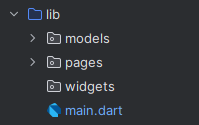
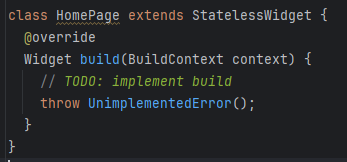

# Nama  : Lukman Eka Septiawan
# Kelas : TI-3C

## Praktikum 5 - Module 6

### Langkah 1 - Siapkan Project Baru

> Penjelasan: langkah di atas adalah membuat folder baru yang digunakan untuk menampung models, widgets, dan pages.

### Langkah 2 - Mendefinisikan Route


> Penjelasan: langkah ini digunakan untuk mendefinisikan route untuk class HomePage dan juga ItemPage.

### Langkah 3 - Lengkapi Kode di main.dart

> Penjelasan: kode di atas digunakan untuk membuat route agar dapat berpindah halaman.

### Langkah 4 - Membuat Data Model

> Penjelasan: Lagkah ini dilakukan untuk membuat model Item yang berisikan nama dan harga.

### Langkah 5 - Lengkapi Kode di Class HomePage

> Penjelasan: pada class HomePage ditambahkan kode di atas yang digunakan untuk menginisialisasi nilai variabel dari model Item sebelumnya.

### Langkah 6 - Membuat ListView dan itemBuilder

> Penjelasan: ListView.builder adalah widget yang digunakan untuk menampilkan daftar item yang dihasilkan secara dinamis, terutama jika jumlah item banyak atau tidak tetap.

> Screenshot diambil setelah menjalankan langkah 7

### Langkah 7 - Menambahkan Aksi Pada ListView

> Penjelasan: penambahan InkWell dan Navigator digunakan agar user dapat berinteraksi dengan tampilan, seperti berpindah halaman.


## Tugas Praktikum 2
1. Untuk melakukan pengiriman data ke halaman berikutnya, cukup menambahkan informasi 
arguments pada penggunaan Navigator. Perbarui kode pada bagian Navigator menjadi 
seperti berikut.
```dart
Navigator.pushNamed(context, '/item', arguments: item);
```

> Penjelasan: penambahan argument pada parameter Navigator digunakan untuk mengirimkan nilai dari objek item.

2. Pembacaan nilai yang dikirimkan pada halaman sebelumnya dapat dilakukan menggunakan 
ModalRoute. Tambahkan kode berikut pada blok fungsi build dalam halaman ItemPage. 
Setelah nilai didapatkan, anda dapat menggunakannya seperti penggunaan variabel pada 
umumnya. (https://docs.flutter.dev/cookbook/navigation/navigate-with-arguments)
```dart
final itemArgs = ModalRoute.of(context)!.settings.arguments as Item;
```

>Penjelasan: kode di atas digunakan untuk membaca nilai yang dikirimkan melalui parameter Navigator, seperti yang telah dilakukan pada tugas nomor 1.

3. Pada hasil akhir dari aplikasi belanja yang telah anda selesaikan, tambahkan atribut 
foto produk, stok, dan rating. Ubahlah tampilan menjadi GridView seperti di aplikasi 
marketplace pada umumnya.
```dart
GridView.builder(
    gridDelegate: const SliverGridDelegateWithFixedCrossAxisCount(
      crossAxisCount: 2, // Jumlah kolom dalam grid
      crossAxisSpacing: 8.0, // Jarak antar kolom
      mainAxisSpacing: 8.0, // Jarak antar baris
      childAspectRatio: 0.7, // Mengatur rasio aspek item grid
    ),
    itemCount: items.length,
    itemBuilder: (context, index) {
      final item = items[index];
      return InkWell(
        onTap: () {
          Navigator.pushNamed(context, '/item', arguments: item);
        },
        child: Card(
          child: Container(
            margin: const EdgeInsets.all(8),
            child: Column(
              crossAxisAlignment: CrossAxisAlignment.start,
              children: [
                Expanded(
                  child: Hero(
                    tag: 'product${item.name}',
                    child: Image.asset(
                      item.photo,
                      fit: BoxFit.cover,
                    ),
                  ),
                ),
                Column(
                  crossAxisAlignment: CrossAxisAlignment.start,
                  children: [
                    Text(
                      item.name,
                      style: const TextStyle(
                        fontSize: 17,
                      ),
                    ),
                    Text(
                      'Rp.${item.price}',
                      style: const TextStyle(
                        fontSize: 18,
                        fontWeight: FontWeight.bold,
                      ),
                    ),
                    Row(
                      crossAxisAlignment: CrossAxisAlignment.center,
                      mainAxisAlignment: MainAxisAlignment.spaceBetween,
                      children: [
                        Text('Stok ${item.stok}'),
                        Row(
                          children: [
                            const Icon(
                              Icons.star,
                              color: Colors.yellow,
                            ),
                            Text(
                              '${item.rating}',
                              style: const TextStyle(
                                fontWeight: FontWeight.bold,
                              ),
                            ),
                          ],
                        ),
                      ],
                    ),
                  ],
                )
              ],
            ),
          ),
        ),
      );
    }
);
```

> Penjelasan: penambahan atribut untuk model item, dan merubah tampilan HomePage agar seperti tampilan marketplace pada umumnya.

4. Silakan implementasikan Hero widget pada aplikasi belanja Anda dengan mempelajari 
dari sumber ini: https://docs.flutter.dev/cookbook/navigation/hero-animations

widget Hero pada home_page
```dart
Hero(
  tag: 'product${item.name}',
  child: Image.asset(
    item.photo,
    fit: BoxFit.cover,
  ),
),
```

widget Hero pada item_page
```dart
Hero(
  tag: 'product${itemArgs.name}',
  child: Image.asset(
    itemArgs.photo,
    height: 300,
    // fit: BoxFit.fitWidth,
  )
),
```
> Penjelasan: dengan mengimplementasikan widget Hero, kita dapat memberikan animasi saat user berpindah halaman.

5. Sesuaikan dan modifikasi tampilan sehingga menjadi aplikasi yang menarik. Selain itu, pecah widget menjadi kode yang lebih kecil. Tambahkan Nama dan NIM di footer aplikasi belanja Anda.

tampilan home_page


tampilan item_page


> Penjelasan: perubahan tampilan dilakukan agar tampilan lebih menarik untuk dilihat oleh user. Tidak hanya itu, pemecahan widget dilakukan agar kode menjadi lebih rapi.

6. Selesaikan Praktikum 5: Navigasi dan Rute tersebut. Cobalah modifikasi menggunakan 
plugin go_router, lalu dokumentasikan dan push ke repository Anda berupa screenshot 
setiap hasil pekerjaan beserta penjelasannya di file README.md. Kumpulkan link 
commit repository GitHub Anda kepada dosen yang telah disepakati!

tampilan home_page


tampilan item_page

> Penjelasan: go_router adalah plugin yang digunakan untuk mengatur routing dalam aplikasi. Pada langkah sebelumnya, kita menggunakan Navigator untuk mengatur routing, dengan merubah proses routing menggunakan go_router, pemanggilan halaman dapat dilakukan secara eksplisit. Penambahan FAB pada ItemPage dilakukan untuk berpindah ke halaman HomePage.